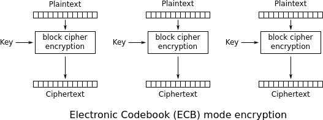
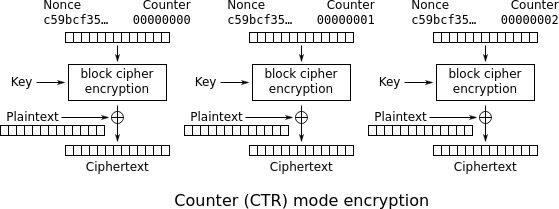
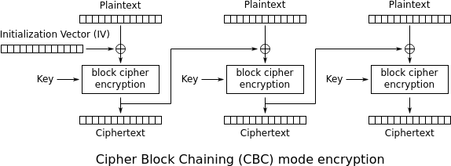
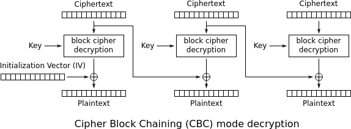

# Coding Problem Set 3: Block Ciphers

I recommend that you finish reading Chapter 4 in *Serious Cryptography* before
you start this problem set.

The PyNaCl library that we used in previous problem sets doesn't include AES,
so for this problem set we need to install a different library. Luckily,
there's something suitable implemented by the [same
folks](https://github.com/pyca) (and also recommended on p. 62). Install the
[`cryptography`](https://github.com/pyca/cryptography) library with:

```
pip install cryptography
```

As before, you might need to write `pip3` instead of `pip` on some systems.
You'll know it worked when you can `import cryptography` without any errors,
like this:

```
$ python
Python 3.9.7 (default, Aug 31 2021, 13:28:12)
[GCC 11.1.0] on linux
Type "help", "copyright", "credits" or "license" for more information.
>>> import cryptography
>>>
```

Once that's working, you're ready to start on Problem 1. If you're using a
language other than Python, you'll need to find a library that provides the AES
block cipher in your language.

Example input:

```json
{
  "problem1": "unicorn turkey q",
  "problem2": "102bc4cd193726b33eaa0d27ff2dc67c",
  "problem3": "cat llama iguana dog butterfly fox narwhal zebra vulture fox quail fox butterfly",
  "problem4": "ef050b9990fd7bac0cebbea289ffe5ccb58a6d94921550cf07aac57e568428b1216df2c44778be8c11c882ae8a4d11b2",
  "problem5": [
    "7a7a7a7a7a7a7a7a7a7a7a7a7a7a7a",
    "7a65627261207268696e6f6365726f732076756c74757265",
    "656c657068616e742079616b20776f6d62617420627574746572666c79",
    "7a7a7a7a7a7a7a7a7a7a7a7a7a7a7a7a7a7a7a7a7a7a7a7a7a7a7a7a7a7a7a7a"
  ],
  "problem6": [
    "616172647661726b207475726b6579207475726b65790a0a0a0a0a0a0a0a0a0a",
    "636174207a656272612079616b030303",
    "79616b207a656272612076756c747572650f0f0f0f0f0f0f0f0f0f0f0f0f0f0f"
  ],
  "problem7": {
    "lyrics": "John Jacob Jingleheimer Schmidt! His name is my name too. Whenever we go out the people always shout there goes John Jacob Jingleheimer Schmidt! Nanananananana...",
    "key": "35f34a75e1f72a5361ea373dbe0d5229"
  },
  "problem8": {
    "key": "9171120a57e34cde9c4aaddda4310b5f",
    "nonce": "fb933f17f2163c9cf2a6ccac",
    "plaintext": "manatee elephant unicorn unicorn sheep"
  },
  "problem9": "f7b6290e3844911e16628a79d4316041"
}
```

Example output:

```json
{
  "problem1": "2f53ca4aa709bb6f504bcd0441a40a87",
  "problem2": "wombat sheep wom",
  "problem3": "ae514851353ee291b4a9a901d4d02ba854146c6946ea1ba15fed0567a940ef47015c30bbabb3291804edc676c10e6ac66ec841fba068cad1c76e8c6e2215e0132416e400da585bceecdf894edb62e392",
  "problem4": "dog giraffe quail turkey xenoceratops pig giraff",
  "problem5": [
    "7a7a7a7a7a7a7a7a7a7a7a7a7a7a7a01",
    "7a65627261207268696e6f6365726f732076756c747572650808080808080808",
    "656c657068616e742079616b20776f6d62617420627574746572666c79030303",
    "7a7a7a7a7a7a7a7a7a7a7a7a7a7a7a7a7a7a7a7a7a7a7a7a7a7a7a7a7a7a7a7a10101010101010101010101010101010"
  ],
  "problem6": [
    "aardvark turkey turkey",
    "cat zebra yak",
    "yak zebra vulture"
  ],
  "problem7": {
    "ciphertext": "fded6e9b1d7464395ee5c56daa65a0e1c4e518fd5ae36c82466df4104ecb32618b7954e627ad85d2777589574717308b7177841e1849cbda95057fed9254a664355cf92f963cda26dbc598ed656d61e00b3fca5a58456dfbdaeb41a8280bee49b9e063504cdb5dc945d472e51a834cf7fded6e9b1d7464395ee5c56daa65a0e1c4e518fd5ae36c82466df4104ecb326108e1b2c7619d98e66877fc5b9eb5984c8e11a156ff50725f0d2158a8866d82e8",
    "repeats": [
      "fded6e9b1d7464395ee5c56daa65a0e1",
      "c4e518fd5ae36c82466df4104ecb3261"
    ]
  },
  "problem8": "5b0cb11c6cabc2dfa041dd10e125421ad9f9b32dd031e03de746e6066b927352f0cd61955b93",
  "problem9": [
    9936629792078761286,
    3410858223443597068,
    2862765579781067967,
    11133535128244297353,
    12966526673390156710
  ]
}
```

## Problem 1: AES block cipher encryption

AES is a block cipher with a 16-byte key and a 16-byte block size. (There are
variants that use larger keys, but for this problem set we'll stick with 16
bytes.) The AES encryption function takes one block of plaintext and produces
one block of ciphertext.

Because the AES block cipher only encrypts exactly 16 bytes at a time -- no
more, no less -- we don't often use it directly, and libraries like
`cryptography` don't usually expose it. Instead, they usually expose higher
level "modes", which can work with messages of any length. But in this problem
we want to start with the block cipher, and to do that we'll need to go through
one of these modes. Just trust me for now that this function does what we want:

```python
from cryptography.hazmat.primitives.ciphers import Cipher, algorithms, modes

def AES_encrypt_block(key, block):
    assert len(key) == 16
    assert len(block) == 16
    return Cipher(algorithms.AES(key), modes.ECB()).encryptor().update(block)
```

Your input is a 16-character ASCII string. Convert this string to bytes and
encrypt it with the AES block cipher, using a key consisting of sixteen `A`
bytes (`b"A" * 16`). Your output should be the encrypted block, encoded as hex.

**Input:** a 16-character ASCII string

**Output:** the encrypted string, hex-encoded

## Problem 2: AES block cipher decryption

This is the inverse of Problem 1 above. We can use a similar function to decrypt:

```python
def AES_decrypt_block(key, block):
    assert len(key) == 16
    assert len(block) == 16
    return Cipher(algorithms.AES(key), modes.ECB()).decryptor().update(block)
```

Your input is a hex-encoded encrypted string, of the same form as your output
in Problem 1. Hex-decode it and decrypt it with the AES block cipher using the
same key. Your output should be the decrypted plaintext, an ASCII string.

**Input:** a 16-byte encrypted block, hex-encoded

**Output:** the decrypted plaintext, a 16-character ASCII string

## Problem 3: ECB mode encryption (p. 65)



The most straightforward way to encrypt a longer message with the block cipher
is to break it up into 16-byte blocks and encrypt each block individually. This
simple approach has a complicated sounding name: Electronic Codebook Mode,
usually abbreviated as ECB mode.
(["Codebooks"](https://en.wikipedia.org/wiki/Codebook) were printed books full
of lookup tables, used for centuries to encode secret messages word-by-word or
phrase-by-phrase. If you squint at it, that's sort of like using a block cipher
to encrypt a message block-by-block.) Now, as we've discussed in class, **ECB
mode doesn't work**. Remember the penguin? But it's a starting point for
getting used to blocks and "padding", and reproducing a simple version of the
penguin issue ourselves in Problem 7 will be nifty.

Without padding, ECB mode is only a small step up from the limitations of the
block cipher. It lets us handle messages longer than 16 bytes, but only if
their length is an exact multiple of 16. We'll address this limitation in
Problem 5, so hold that thought. Your input for this problem will be an ASCII
string whose length is a multiple of 16. Implement ECB mode encryption by
looping over 16-byte blocks of the input and encrypting each of them with the
AES block cipher, using the same key as above (`b"A" * 16`). Your output should
be the encrypted ciphertext, encoded as hex.

Remember that in Python, "slicing" 16-byte blocks of `some_bytes` looks like
this: `some_bytes[0:16]`, `some_bytes[16:32]`, etc. Also remember that byte
strings can be "concatenated" with the `+` operator.

**Input:** an ASCII string whose length is a multiple of 16

**Output:** the encrypted ciphertext, encoded as hex

You might be tempted to use the `cryptography` library's own implementation of
ECB mode as a shortcut in this problem, but I recommend doing the work yourself
using the `AES_encrypt_block` helper function above. This is useful practice
for later problems.

## Problem 4: ECB mode decryption


This is the inverse of Problem 3 above. Your input is a hex-encoded encrypted
string, of the same form as your output in Problem 3. Implement ECB mode
decryption, this time by looping over 16-byte blocks of the ciphertext and
decrypting each one, again using the same key. Your output should be the
decrypted plaintext, an ASCII string.

**Input:** an encrypted ciphertext whose length is a multiple of 16, hex-encoded

**Output:** the decrypted plaintext

Now that you've got a feel for ECB mode, you can see why we referred to it
inside the `AES_encrypt_block` and `AES_decrypt_block` helper functions above.
Encrypting or decrypting a 16-byte string using ECB mode is equivalent to using
the AES block cipher directly.

## Problem 5: PKCS#7 padding (p. 69)

Now we need to think about what to do with messages that aren't an exact
multiple of 16 bytes. Somehow we need to "pad" them up to an exact multiple, in
some reversible way that we can undo later after decryption. (Note that "pad"
in this sense doesn't really have anything to do with a "one-time pad". That
originally referred to a "pad of paper", but here we mean "padding" as in
stuffing or filling.)

This is a bit trickier than it might seem at first. For example, a naive
approach like "just append null/zero bytes until the message length is a
multiple of 16" doesn't work, because it's not reversible. If our message
happened to end with some null bytes, then we'd get confused about how many
bytes to take off when we tried to remove the padding. We need to make sure
that our padding scheme always lets us recover the exact original input, no
matter what bytes it contained.

Before reading further, take a moment to think about ways you might solve this
problem. There are many different ways.

The way we're going to use here is called PKCS#7 padding. Again, this is a
complicated-sounding name for a relatively simple idea. Here's how it works:
Figure out how many bytes of padding you need, call that N. Then append N bytes
to your input, each of which also has the *value* N. For example, if the last
block of your input was 15 bytes long, then you'd need 1 byte of padding, and
you'd append `b"\x01"` or `bytes([1])` to the input. Or if the last block of
your input was 13 bytes long, then you'd need 3 bytes of padding, and you'd
append `b"\x03\x03\x03`" or `bytes([3, 3, 3])` to the input.

Note that computing "how many bytes of padding you need" usually involves a
"remainder" or "modulo" operation, which is `%` in Python and most other
languages. If you're not totally clear on what `%` does, refer back to your
favorite Python textbook for a refresher ([here's my
favorite](http://openbookproject.net/thinkcs/python/english3e/variables_expressions_statements.html#the-modulus-operator)),
or take a look at the [official Python
docs](https://docs.python.org/3/tutorial/introduction.html#numbers).

There's a corner case to watch out for here: If the input is *already* a
multiple of 16, we can't just do nothing. Depending on the input bytes, we
might get confused again when we tried to remove the padding. Instead, in that
case, we need to pad with a _full block_ of 16 bytes, each with the value 16.

Your input for this problem is a list of byte strings of various lengths, which
have been hex-encoded. Hex-decode each input string into bytes, pad its length
to an even multiple of 16 using PKCS#7 padding, and re-encode the result as
hex. Your output should be the list of these padded, hex-encoded strings.

**Input:** a list of hex-encoded byte strings of various lengths

**Output:** a list of hex-encoded byte strings, each of which has been padded with PKCS#7 to a multiple of 16 bytes

## Problem 6: PKCS#7 unpadding

This is the inverse of Problem 5 above. Your input is a list of hex-encoded,
PKCS#7 padded byte strings, of the same form as your output in Problem 5.
Decode each of the hex strings into bytes, undo the PKCS#7 padding, and convert
the result into an ASCII string. Your input should be the list of these
strings.

**Input:** a list of hex-encoded byte strings, each of which has been padded with PKCS#7 to a multiple of 16 bytes

**Output:** a list of ASCII strings

## Problem 7: the ECB mode penguin (p. 66)

Ok, we have ECB mode and PKCS#7 padding working. That means we can encrypt
messages of any length, by padding them before encryption and unpadding them
after decryption. Cool.

Now it's time to get back to what we said before about how **ECB mode doesn't
actually work**. We can see the "ECB mode penguin" on p. 66 of *Serious
Cryptography*, and we can also see it [on
Wikipedia](https://en.wikipedia.org/wiki/Block_cipher_mode_of_operation#ECB).
The clearly visible outline of the "encrypted" penguin is proof that ECB mode
isn't giving us privacy. A good cipher should have output that's totally
indistinguishable from random, no matter the input.

Let's reproduce this effect ourselves. Instead of than messing around with
pixels, we can accomplish the same thing with some lyrics from [a song that
some of you might know](https://youtu.be/-ebTwbutN9I?t=46).

Your input for this problem as an object with two fields. The `"lyrics"` field
is an ASCII string containing a few lines from that song. Unlike most of our
inputs, this string is always the same. The `"key"` field is a 16-byte key
encoded as hex. Convert the lyrics into bytes and pad them with PKCS#7 to a
multiple of 16 bytes. Then encrypt those padded bytes with AES in ECB mode
using the provided key. Encode the resulting ciphertext as hex, and take a look
at it. It contains some repeated blocks! Just like the penguin! A curious
attacker might be able to guess what song we were singing...

Your output for this problem shold be an object with two fields. The
`"ciphertext"` field should contain the ciphertext you created above, encoded
as hex. The `"repeats"` field should be a list, containing each of the 16-byte
blocks encoded as hex that repeated more than once in the ciphertext. Because
the lyrics string is fixed, there will always be exactly two such blocks, and
always in the same positions. You don't need to write code to search for the
repeated blocks unless you feel like it.

**Input:** an object with two fields, `"lyrics"` (an ASCII string) and `"key"` (a hex-encoded key)

**Output:** an object with two fields, `"ciphertext"` (a hex string) and `"repeats"` (a list of two hex blocks)

## Problem 8: CTR mode encryption and decryption (p. 71)

So...we just spend a lot of time with a block cipher mode that doesn't work.
What *does* work then?



Most modern cipher designs are based on CTR ("counter") mode. The most striking
feature of CTR mode is that the plaintext doesn't actually go through the block
cipher itself. Instead, the block cipher input is a nonce (which is unique for
each message but the same for all the blocks) concatenated with a counter
(which starts at 0 and increments for each block). The block cipher output is
then xor'd with the plaintext, much like a one-time pad. In other words, CTR
mode turns a block cipher into a *stream cipher*.

Two convenient things follow from this: Because CTR mode is a stream cipher,
there's no need for padding. If the last block of the message is shorter than
16 bytes, we can just discard the last few bytes of block cipher output, just
like we would if we had a one-time pad that was longer than it needed to be.
Also, because xor is its own inverse, encryption and decryption are the same
operation, and we don't need a separate decryption function. In fact, we don't
need the decryption side of the AES block cipher *at all*. (This savings can
matter when AES is implemented in hardware.)

For this problem, we're going to implement CTR mode encryption/decryption,
which again is actually just one function. Note that the code listing on p. 71
is not going to be helpful for us here; it's referring to a CTR implementation
provided by yet another Python library, but here we want to implement CTR
ourselves, using the `AES_encrypt_block` helper function that we've been using
all along.

As you can see in the diagram above, the nonce bytes and the counter bytes get
concatenated to form the 16-byte AES input block. That means that they have to
be exactly 16 bytes put together. We'll use 12 bytes for the nonce and the
remaining 4 bytes for the counter. We'll also use the **big-endian** encoding
for those counter bytes. Both of these choices are for compatibility with
AES-GCM, which we'll learn all about in Chapter 8. Note that "4 big-endian
bytes" is exactly how the counter is represented in the diagram.

Your input for this problem is an object with three fields. The `"key"` field
contains a random 16-byte key, encoded as hex. The `"nonce"` field contains a
random 12-byte nonce, encoded as hex. The `"plaintext"` field contains an ASCII
string. Convert the plaintext to bytes and encrypt it with your implementation
of AES-CTR, using the provided key and nonce. Bear in mind that the plaintext
string might be of any length, so you need to handle lengths that aren't a
multiple of 16. Your output should be the resulting ciphertext, encoded as hex.

**Input:** an object with three fields, `"key"` (a hex-encoded key), `"nonce"` (a hex-encoded nonce), and `"plaintext"` (an ASCII string)

**Output:** the hex-encoded ciphertext

## Problem 9: CTR mode as a random number generator

It turns out that a stream cipher and a (cryptographically secure) random
number generator have a lot in common. Their output is the same, a stream of
bytes that's indistinguishable from random. The only difference is that stream
cipher uses a "key" and a "nonce", while the RNG uses a "seed". That's not a
very big difference.

Your input for this problem is a random 16-byte key, encoded as hex. Use this
key as a "seed", set your nonce to all zero/null bytes (`b"\x00" * 12`), and
treat your AES-CTR output as a stream of random bytes. In this use case, we
don't have any "input", so you can either skip the xor step entirely, or just
pretend that the input is all zero/null bytes. (Remember that xor with zero has
no effect.) Convert the first 40 bytes of AES-CTR stream output into five
random 8-byte/64-bit **little-endian** unsigned integers, using
`int.from_bytes(..., "little")`. Your output should be the list of these five
random numbers.

Apologies for jumping back and forth between big-endian and little-endian
encoding in this problem set. The modern rule of thumb is to prefer the
little-endian encoding, except where compatibility requirements require us to
use big-endian.

**Input:** a random 16-byte key, encoded as hex

**Output:** a list of five random 64-bit integers

## Problem 9¾: CBC mode (p. 67)

The real problems are finished. This last problem has no input or output and is
not graded. It's just extra work that you can do for fun if you feel like this
problem set wasn't hard enough :)

<p float="left">
  
  
</p>

In the previous problems, we skipped from ECB mode straight to CTR mode, and we
didn't have time to take a look at CBC ("cipher block chaining") mode. CBC mode
feels a bit more like ECB mode, in that the plaintext actually goes through the
block cipher. The "chaining" step makes sure that identical plaintext blocks
don't encrypt to identical ciphertext blocks, so our penguins remain hidden,
and CBC mode does in fact protect privacy.

Also like ECB mode, CBC mode requires padding the message to the block length.
PKCS#7 is often used, but there's a more creative alternative that's a bit more
efficient: "ciphertext stealing". You can read a description of ciphertext
stealing on p. 70 of *Serious Cryptography*. Somewhat surprisingly, this
technique solves the padding problem without taking up any extra space. But it
takes a bit more thinking to see why it works.

If you're feeling up to it, implement CBC mode with ciphertext stealing. Here
are a few [test vectors for your
implementation](https://searchfox.org/mozilla-beta/source/security/nss/cmd/bltest/tests/aes_cts/aes-cts-type-1-vectors.txt).
Once you've got it working, consider a few questions:

- Each block of ciphertext in CBC mode depends on the previous block. What does
  that mean for encryption performance?
- What about decryption?
- If I flipped a bit in a CBC mode ciphertext, what would happen to the
  resulting plaintext after decryption? How does that compare to CTR mode?
- Does CBC mode's "initialization vector" need to be fully random? Or is it
  sufficient for it to be unique, like the CTR mode nonce?

We might not have time to consider these questions in class, especially since
CBC mode isn't often used in modern designs, but I would be *thrilled* to
discuss them in office hours if anyone is interested.
