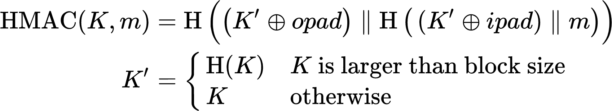

# Coding Problem Set 5: Keyed Hashing

Example input:

```json
{
  "problem1": {
    "key": "3e0561aa00abf43e8eed31c4bae288ba4cbdef27149ccedeea3f18c0d6e5ce18197c6fd7e610acc42ac2a2d4332a8bd0eec0480b05b2bceb1628ac50036a33f5",
    "message": "llama llama sheep turkey elephant"
  },
  "problem2": 50,
  "problem3": "manatee wombat sheep iguana manatee",
  "problem4": "kangaroo yak llama jaguar yak"
}
```

Example output:

```json
{
  "problem1": "9898a85349de6553522106a8d68328f877668e09442cc47c2f55e60ada783cad",
  "problem2": "1f9588a7f2f8916c71f899544a4aa85cd0f484775f28fa114c60dd7d6202048a30a97ff1d5632dca8e963af48b4f004c235c",
  "problem3": "1e4182043e47e548ff62888cb7225bf0",
  "problem4": "27c55da24a0648dfaaa7a6d073788bd0548e69ebcb1e03fa64f32047317067a5cdec6b9610b08a639ae4b91e5a"
}
```

## Problem 1: HMAC-SHA-256

We saw the definition of HMAC [in our
slides](https://docs.google.com/presentation/d/1XIHwoyy-k97JGsU74-t48SjwY4xLU-d8R6g48zgZJRs/edit#slide=id.gf8bca161e1_0_11)
and on p. 132 of *Serious Cryptography*. Here's [Wikipedia's
version](https://en.wikipedia.org/wiki/HMAC) of the same formula:

<kbd></kbd>

Let's implement HMAC ourselves, using SHA-256 for H. You can use the `hashlib`
implementation of SHA-256 for this problem, as we did in Problem 1 of Problem
Set 4. (Or if you're already far along in the SHA-256 project, and you want to
use your own implementation here, go for it.) The symbol ⊕ means XOR, and the
symbol ‖ means concatenation. The constant *ipad* is `b"\x36" * 64`, and the
constant *opad* is `b"\x5c" * 64`. For simplicity, let's assume our K is
exactly 64 bytes, so that we don't need to bother with padding it, and we can
ignore the difference between K and K'.

Your input for this problem is an object with two fields, `"key"` containing a
random 64-byte key that has been hex-encoded, and `"message"` containing an
ASCII string. Hex-decode the key into 64 bytes, and convert the message into
ASCII bytes. Then compute the HMAC-SHA-256 of the key and the message, as
follows:

1. XOR the original key with *ipad* using `xor_bytes`, the same helper function
   from Problem Set 2. Call this the "masked inner key".
2. Concatenate the masked inner key with the message and hash them with
   SHA-256. Call this 32-byte hash the "inner hash". Make sure to get this hash
   as bytes with `.digest()`, not as hex with `.hexdigest()`.
3. XOR the original key with *opad* using `xor_bytes`. Call this the "masked
   outer key".
4. Concatenate the masked outer key with the bytes of the inner hash and hash
   them with SHA-256 again. This 32-byte hash is the HMAC of the key and the
   message. Here you can use `.hexdigest()` if you like.

Your output for this problem should be that 32-byte HMAC, encoded as hex.

**Input:** an object with two fields, `"key"` and `"message"`

**Output:** the HMAC-SHA-256 of that key and message, encoded as hex

Of course, you can short-circuit this entire problem with `import hmac`. It's
not what I'd prefer, but on the other hand, learning to use the standard
library is important too. I'll leave it up to you. The best of both worlds is
to write the code yourself and then use `import hmac` to test what you wrote.
But if you're finding the ongoing SHA-256 Project overwhelming, I want you to
focus on that, and I won't blame you for taking a shortcut on this problem. You
can always [come back to it](https://youtu.be/8kpHK4YIwY4?t=66).

### An obscure footnote about HMAC and how we design our tools

This section is commentary, and again you can skip it if you're busy.

We're not using any keys shorter or longer than 64 bytes in this problem, but
you can write a few extra lines of code to handle those cases if you like. If
you do, you might notice something odd. By now we've encountered two forms of
padding, the PKCS#7 scheme often used with CBC mode, and the SHA-256 internal
padding scheme. In both of those cases, we paid careful attention to ambiguity
issues, to make sure that no two inputs ever looked the same after padding. But
that's not the case here! The way keys are padded in HMAC introduces not one
but *two* forms of ambiguity:

- If two keys are both shorter than 64 bytes, and one is a prefix of the other,
  and the suffix is all zero bytes, they are equivalent.
- If one key is longer than 64 bytes, and the other key is the hash of the
  first one, they are equivalent.

You can see this for yourself in the interpreter:

```
>>> import hashlib
>>> import hmac

>>> hmac.digest(b"foo", b"bar", hashlib.sha256).hex()
'f9320baf0249169e73850cd6156ded0106e2bb6ad8cab01b7bbbebe6d1065317'
>>> hmac.digest(b"foo\0\0\0", b"bar", hashlib.sha256).hex()
'f9320baf0249169e73850cd6156ded0106e2bb6ad8cab01b7bbbebe6d1065317'

>>> hmac.digest(b"foo"*100, b"bar", hashlib.sha256).hex()
'62f354308b2b4bc2bd17495d5fa3c368abcac11a9eabcce64fc8dcaf415feb05'
>>> hmac.digest(hashlib.sha256(b"foo"*100).digest(), b"bar", hashlib.sha256).hex()
'62f354308b2b4bc2bd17495d5fa3c368abcac11a9eabcce64fc8dcaf415feb05'
```

These ambiguities lead to an obscure but surprising property of HMAC: it's
resistant to collisions in the message but *not in the key*. This property is
obscure enough that I forgot all about it when we were discussing the collision
resistance of HMAC in class. Collision resistance on the key wasn't considered
a design requirement for HMAC, and it's rarely an issue in practice, because
our HMAC keys are usually random and/or fixed-length. But applications also
sometimes use HMAC as a general-purpose "hash of two inputs", and in that use
case, if the details ever happened to line up just so, this surprising gap in
collision resistance could bite someone someday.

I've never heard of any real-world exploits related to this property. But all
the same, it would've been _so easy_ to make this problem go away, by using an
unambiguous padding scheme for the key. In your future careers, some of you
might end up designing new cryptographic building blocks like HMAC. When you
do, please consider this a cautionary tale. Our designs often find their way
into use cases we didn't expect, and any little gaps or quirks in them turn
into obscure pitfalls that classes like this one need to teach. Crypto is hard,
but sometimes we make it harder than it needs to be. We can do better!

## Problem 2: XSalsa20

Now that you know about keyed hashes and MACs, we can finally talk about what
secretbox is doing on the inside. We've mentioned before that secretbox is
really XSalsa20-Poly1305, that is, the combination of the XSalsa20 stream
cipher with the Poly1305 MAC. In the remainder of this problem set, we'll
introduce these two building blocks and then put them together.

We don't often see XSalsa20 outside of secretbox, and our PyNaCl library
doesn't give it to us directly. So we'll need [a new
dependency](https://github.com/keybase/python-salsa20), just for this one
problem set:

```
pip install salsa20
```

As before, you might need to write `pip3` instead of `pip` on some systems.

Here's a quick example of generating 10 bytes of an XSalsa20 stream from a
random key and nonce. Try it yourself:

```
>>> import salsa20
>>> import secrets
>>> nonce = secrets.token_bytes(24)
>>> key = secrets.token_bytes(32)
>>> salsa20.XSalsa20_keystream(10, nonce, key)
b'\xbf(yZ\x1d8\x82\xfakx'
>>> salsa20.XSalsa20_keystream(10, nonce, key)
b'\xbf(yZ\x1d8\x82\xfakx'                      <-- notice that the stream is pseudorandom but deterministic
```

What's going on here is very similar to what we did in Problem&nbsp;9 of
Problem&nbsp;Set&nbsp;3. Back then we used AES-CTR to generate a "stream" of
pseudorandom bytes. Now we're using XSalsa20 the same way.

Your input for this problem is a number. Using the key `b"D" * 32` and the nonce
`b"E" * 24`, generate that number of pseudorandom bytes with the XSalsa20 stream
cipher. (Use that number where I used the number 10 in my example above.) Your
output is those pseudorandom bytes, encoded as hex.

**Input:** a number of pseudorandom bytes to generate with XSalsa20

**Output:** those pseudorandom bytes, hex-encoded

## Problem 3: Poly1305

Now that we've seen XSalsa20, let's take a look at its counterpart, Poly1305.
Poly1305 is available in the `cryptography` library that we installed back in
Problem&nbsp;Set&nbsp;3, so we don't need any new libraries this time.

Take a few minutes to look through the [`cryptography` docs for
Poly1305](https://cryptography.io/en/latest/hazmat/primitives/mac/poly1305/).
This will be important below, so click on that link now; don't skip it. Notice
all the warnings. Also notice the
[`verify_tag`](https://cryptography.io/en/latest/hazmat/primitives/mac/poly1305/#cryptography.hazmat.primitives.poly1305.Poly1305.verify_tag)
function provided, which "securely compares" two tags. This refers to a
constant-time equality check, similar to
[`secrets.compare_digest`](https://docs.python.org/3/library/secrets.html#secrets.compare_digest).
That's important with Poly1305 for the same reason it's important with HMAC.

Calling Poly1305 is straightforward. It takes a key and a message, like HMAC
does. Here's another quick example that you can try yourself:

```
>>> from cryptography.hazmat.primitives.poly1305 import Poly1305
>>> import secrets
>>> key = secrets.token_bytes(32)
>>> message = b"hello world"
>>> Poly1305.generate_tag(key, message)
b'\xa8/;P\x8c^\x87\xec\xb0\xcc\xb8\x98e\x1e]\xc9'
```

Your input for this problem is an ASCII string. Convert this string to bytes.
Using the key `b"F" * 32`, compute the Poly1305 MAC of those input bytes. Your
output for this problem should be that MAC, hex-encoded.

**Input:** an ASCII string

**Output:** the hex-encoded Poly1305 MAC of that string

## Problem 4: secretbox

The [Poly1305
docs](https://cryptography.io/en/latest/hazmat/primitives/mac/poly1305/) that I
linked to in the previous problem include these lines near the top:

> Each key must only be used once...Using the same key to generate tags for
> multiple messages allows an attacker to forge tags.

Did you notice those lines the first time you read the docs? If not, go back
and find them. This sort of thing is why this part of the `cryptography`
library is called "hazmat" (hazardous materials). It's like the nonce rule all
over again: if you reuse a key, you lose all your security. It's actually
worse, because in this case you might also leak your key. Real world
applications get broken all the time because they overlook details like this.

Will you need to know this particular detail in the future? No, probably not.
We don't use Poly1305 by itself very often. But always remember *this sort of
thing*. When you read docs for cryptography tools, read them slowly and
carefully, and look for the rules. Now that you know what you're looking for,
can you spot the same rule [in the OpenSSL docs for
Poly1305](https://www.openssl.org/docs/manmaster/man7/EVP_MAC-Poly1305.html)?
This is what we're up against.

Anyway, back to secretbox. Because of the one-time-use rule on the Poly1305
key, we need to generate a fresh key for each message. Luckily, we already have
the perfect tool for this, the XSalsa20 stream cipher itself. We'll use part of
the pseudorandom stream as our Poly1305 key. Here's the procedure:

1. Add 32 to the length of your plaintext and generate that many bytes from the
   XSalsa20 stream, using your original key and nonce.
2. Reserve the first 32 of those bytes for a Poly1305 key.
3. XOR the rest of the stream with your plaintext, using `xor_bytes`.
4. Compute the 16-byte Poly1305 MAC of the encrypted bytes from step&nbsp;3
   (not the plaintext), using the key from step&nbsp;2.
5. *Pre*pend that 16-byte MAC to the encrypted bytes from step 3. (The MAC
   comes first. Be careful not to get this backwards.) The concatenated result
   is the secretbox ciphertext.

Write a function like `secretbox(key, nonce, plaintext)` implementing the
procedure above. Your input for this problem is an ASCII string. Convert the
string to bytes and encrypt it with your `secretbox()` function, using the key
`b"G" * 32` and the nonce `b"H" * 24`. Your output should be the resulting
ciphertext, hex-encoded.

**Input:** an ASCII string

**Output:** the hex-encoded secretbox ciphertext containing that string

You don't need to code the decryption function for this problem, but you can do
it as an exercise if you like. Before reading the list of
decryption/verification steps below, take a minute and see if you can figure
out what they should be. Write out your steps on a piece of paper or something.
After you've written them down, check them against this list:

1. Split the ciphertext into the Poly1305 authentication tag (the first 16
   bytes) and the encrypted message (the rest).
2. Add 32 to the length of the encrypted message and generate that many bytes
   from the XSalsa20 stream, using the original key and nonce.
3. Reserve the first 32 bytes of that stream output for a Poly1305 key.
4. Recompute the Poly1305 MAC of the encrypted message, using that key.
5. Using a **constant-time equality check**, compare the MAC you just computed
   to the authentication tag you got in step&nbsp;1. If they aren't equal,
   abort with an error.
6. XOR the rest of the stream with the encrypted message, using `xor_bytes`.
   The result is the authenticated plaintext.

Note the part in bold. Forgetting to use a constant-time equality check for
things like this (including HMAC) is a common mistake in practice. This makes
higher-level "authenticated encryption" constructions like secretbox especially
helpful: They let library authors take care of these details, so that callers
don't need to know about them.

As with Problem 1, you can shortcut this whole problem by calling a library
function. Again, I'll [leave it up to you](https://youtu.be/Lweuy1X9Tcg?t=173).
